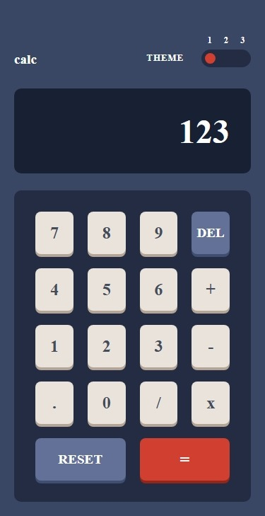
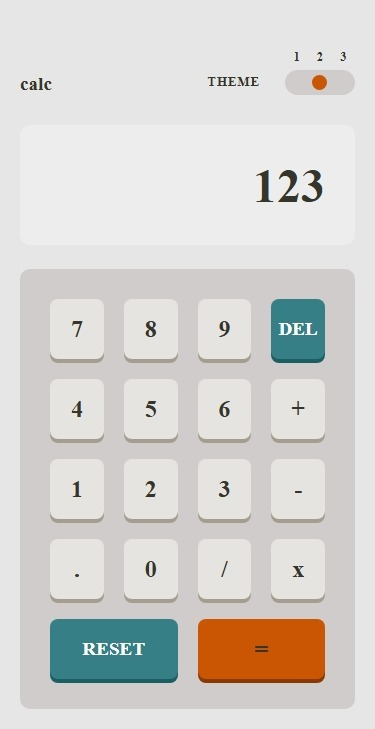
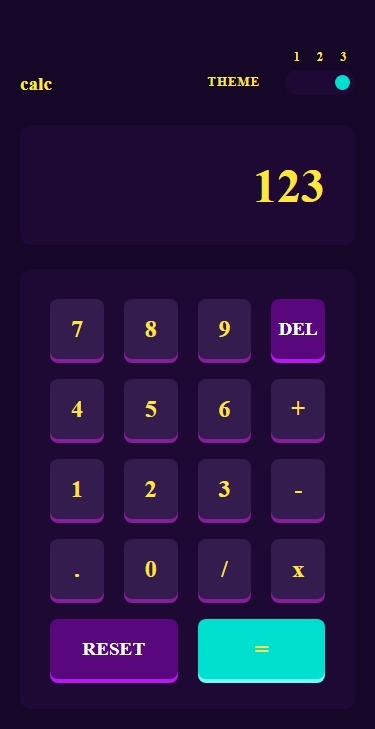
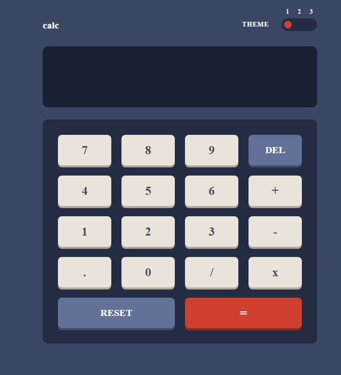
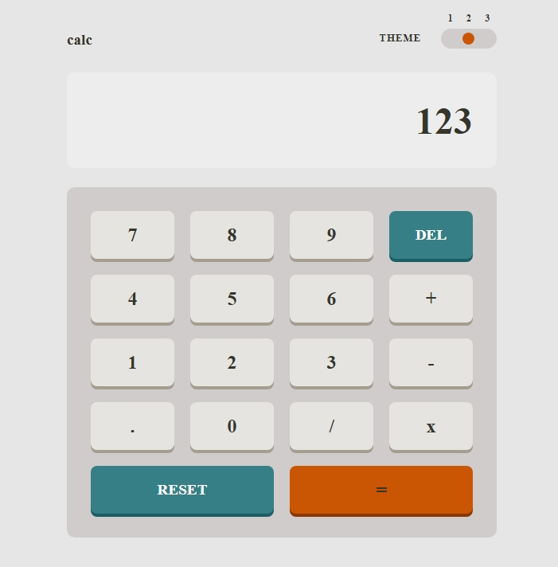
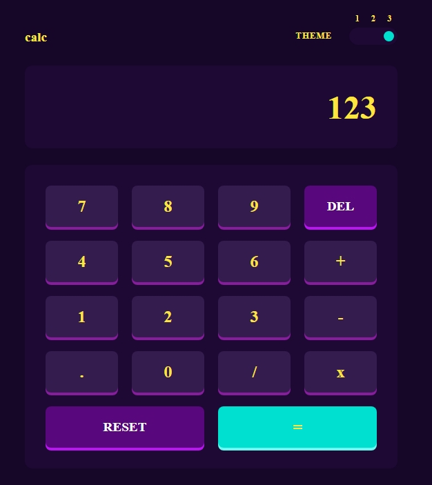

# Frontend Mentor - Calculator app solution

This is a solution to the [Calculator app challenge on Frontend Mentor](https://www.frontendmentor.io/challenges/calculator-app-9lteq5N29). Frontend Mentor challenges help you improve your coding skills by building realistic projects. 

## Table of contents

- [Overview](#overview)
  - [The challenge](#the-challenge)
  - [Screenshot](#screenshot)
  - [Links](#links)
- [My process](#my-process)
  - [Built with](#built-with)
  - [What I learned](#what-i-learned)
  - [Continued development](#continued-development)
  - [Useful resources](#useful-resources)
- [Author](#author)
- [Acknowledgments](#acknowledgments)


## Overview

### The challenge

Users should be able to:

- See the size of the elements adjust based on their device's screen size
- Perform mathmatical operations like addition, subtraction, multiplication, and division
- Adjust the color theme based on their preference
- **Bonus**: Have their initial theme preference checked using `prefers-color-scheme` and have any additional changes saved in the browser

### Screenshot

;
;
;
;
;
;


### Links

- Solution URL: https://github.com/Dev-sadeeq/Calculator
- Live Site URL: https://dev-sadeeq.github.io/Calculator/
## My process

### Built with

-Semantic HTML5
-CSS custom properties (CSS variables)
-Flexbox
-CSS Grid
-Mobile-first workflow
Vanilla JavaScript (DOM manipulation & event handling)

### What I learned

This project helped me better understand:
-CSS Custom Properties for Themes
Instead of rewriting styles for each theme, I used CSS variables and changed them dynamically using body classes:

```html
<h1>Some HTML code I'm proud of</h1>
```
```css
body.theme-2 {
  --main-bg: hsl(0, 0%, 90%);
  --screen-bg: hsl(0, 0%, 93%);
}
```

### Continued development

In future versions, I would like to:
-Replace eval() with a safer custom parser
-Save the selected theme in localStorage
-Add keyboard support for better accessibility
-Improve animation and transitions between themes

### Useful resources

-MDN Web Docs – For understanding DOM manipulation and JavaScript methods

## Author

- Frontend Mentor - [@Dev-sadeeq](https://www.frontendmentor.io/profile/Dev-sadeeq)
- Twitter - [@Dev_sadeeqq](https://www.twitter.com/Dev_sadeeqq)


## Acknowledgments

I built this project independently as part of my frontend development practice. It helped strengthen my JavaScript fundamentals and improve my problem-solving skills.
